# Codezilla Architecture

> **Codezilla v2.0** — AI-powered coding assistant written in Rust.

---

## Table of Contents

1. [Overview](#overview)
2. [Project Structure](#project-structure)
3. [Module Graph](#module-graph)
4. [Startup & CLI Flow](#startup--cli-flow)
5. [Request Lifecycle](#request-lifecycle)
6. [System Layer](#system-layer)
   - [Config Resolution](#config-resolution)
   - [ConversationRuntime](#conversationruntime)
   - [Persistence (SQLite)](#persistence-sqlite)
   - [Tool System](#tool-system)
   - [Approval Pipeline](#approval-pipeline)
   - [Event Bus](#event-bus)
7. [LLM Layer](#llm-layer)
8. [Surface Layer](#surface-layer)
   - [InteractiveSurface (TUI)](#interactivesurface-tui)
   - [ExecSurface](#execsurface)
   - [AppServer (JSON-RPC)](#appserver-json-rpc)
   - [ExecServer (JSON-RPC)](#execserver-json-rpc)
9. [Data Model](#data-model)
10. [Key Flows](#key-flows)
    - [Interactive Turn](#interactive-turn-flow)
    - [Tool Call Round-trip](#tool-call-round-trip)
    - [Approval Flow](#approval-flow)

---

## Overview

Codezilla is a single Rust binary (`src/main.rs`) that boots a Tokio multi-threaded runtime and dispatches to one of several *surfaces* based on the CLI sub-command.  All long-running conversational logic lives in `ConversationRuntime`, which sits between every surface and the underlying LLM/persistence layers.

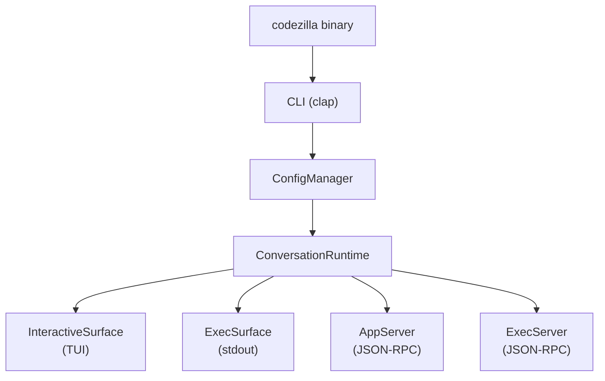

---

## Project Structure

```
codezilla/
├── src/
│   ├── main.rs               # Entry point, CLI, surfaces dispatch
│   ├── config/
│   │   └── mod.rs            # Legacy LLM config (YAML → Config struct)
│   ├── llm/
│   │   ├── mod.rs            # Core types: Message, LlmClient trait, StreamChunk
│   │   ├── client.rs         # UnifiedClient — dispatches to provider impls
│   │   └── providers/
│   │       ├── mod.rs
│   │       ├── ollama.rs     # Ollama OpenAI-compat provider
│   │       ├── openai.rs     # OpenAI / openai-compat provider
│   │       ├── anthropic.rs  # Anthropic provider
│   │       └── gemini.rs     # Google Gemini provider
│   ├── logger/
│   │   └── mod.rs            # tracing subscriber init (file-only, JSON)
│   └── system/
│       ├── mod.rs            # Re-exports from sub-modules
│       ├── config.rs         # EffectiveConfig, ConfigManager, AuthManager
│       ├── domain.rs         # All domain types (enums, structs, type aliases)
│       ├── persistence.rs    # SQLite via rusqlite (threads/turns/items)
│       ├── runtime.rs        # ConversationRuntime + all manager types
│       ├── surfaces.rs       # InteractiveSurface, ExecSurface
│       ├── server.rs         # AppServer, ExecServer (JSON-RPC over stdio)
│       └── interactive_tui.rs# ratatui TUI — full interactive terminal UI
├── Cargo.toml
├── config.yaml               # Default runtime config
├── skills/                   # Markdown skill definitions
└── docs/
    └── ARCHITECTURE.md       # This file
```

---

## Module Graph

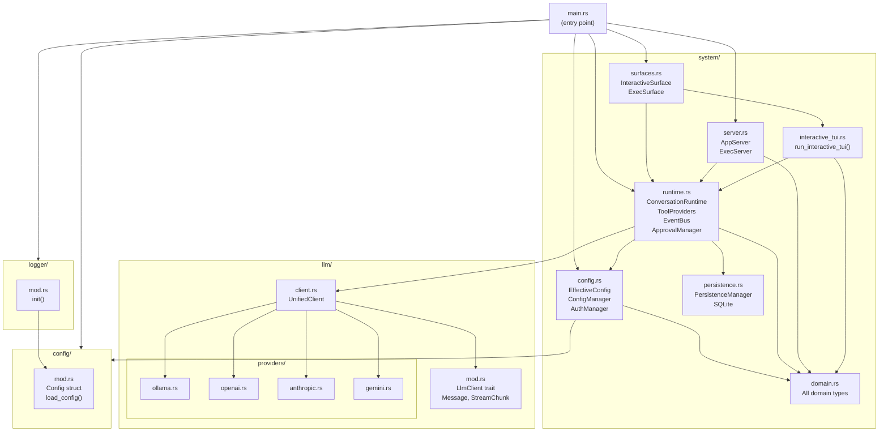

---

## Startup & CLI Flow

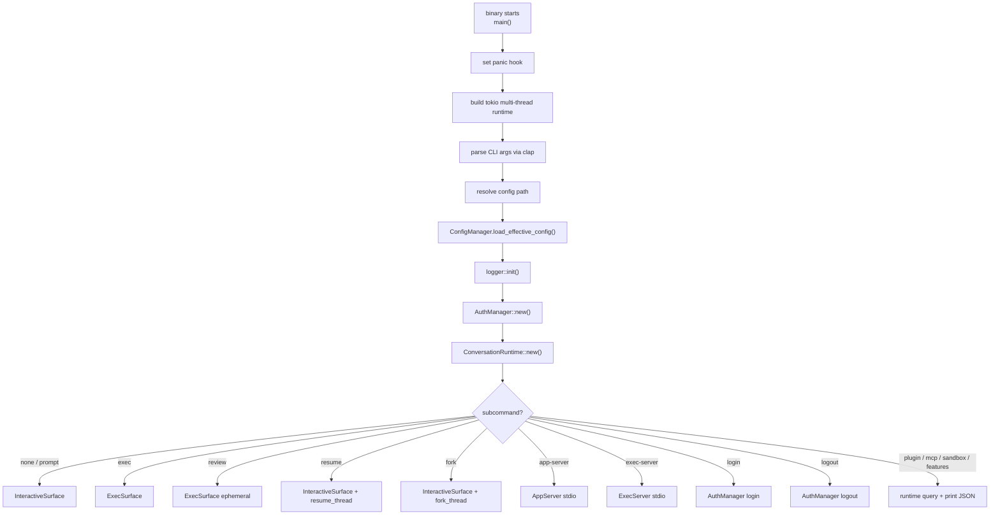

---

## Request Lifecycle

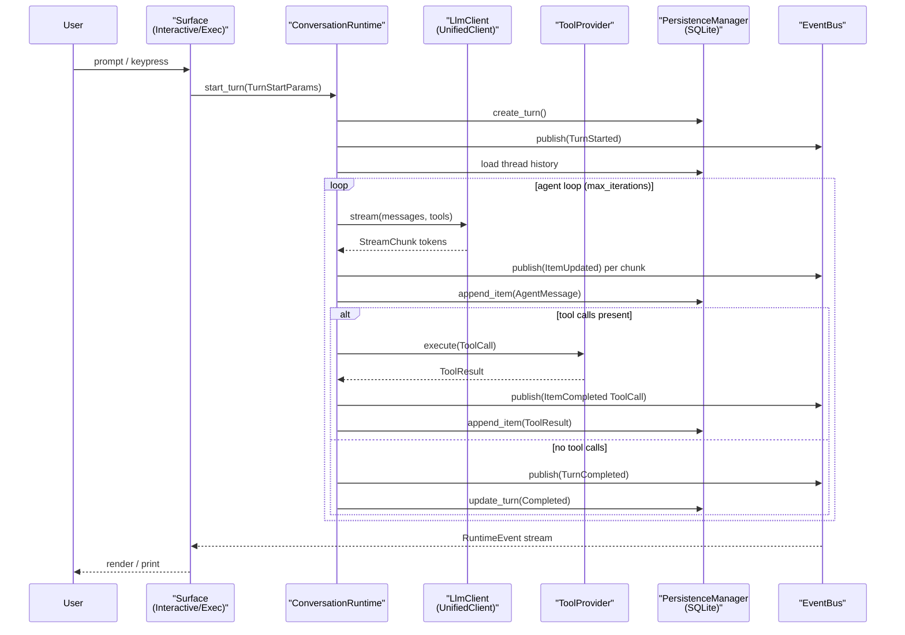

---

## System Layer

### Config Resolution

Two config layers coexist:

| Layer | Type | File |
|---|---|---|
| **Legacy LLM Config** | `config::Config` | `src/config/mod.rs` |
| **Effective / Spec Config** | `system::config::EffectiveConfig` | `src/system/config.rs` |

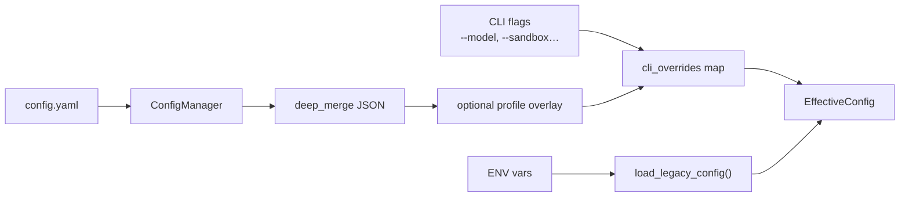

`EffectiveConfig` embeds the legacy `Config` as `legacy_llm_config` so `ConversationRuntime` can access provider/model settings without a second config system.

---

### ConversationRuntime

The central coordinator in `src/system/runtime.rs`. It owns:

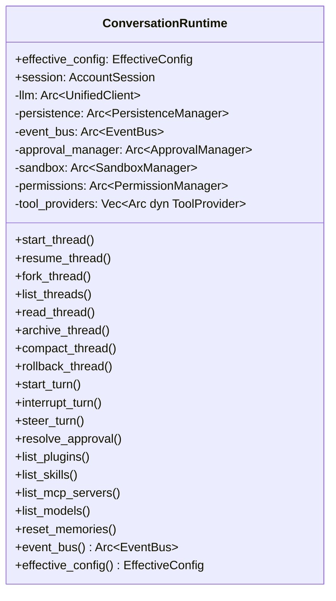

`start_turn()` spawns an async task that drives the full agent loop — LLM calls, tool dispatch, event publishing and persistence — without blocking the caller.

---

### Persistence (SQLite)

Managed by `PersistenceManager` in `src/system/persistence.rs`.  Uses `rusqlite` with WAL journal mode.

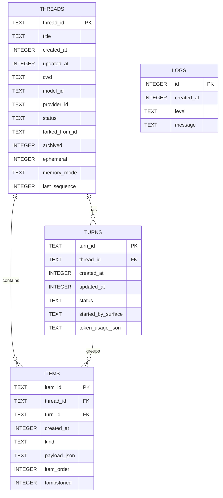

On startup, `PersistenceManager` calls `recover_incomplete_turns()` to mark any `Running` or `WaitingForApproval` turns as `Interrupted` (crash recovery).

---

### Tool System

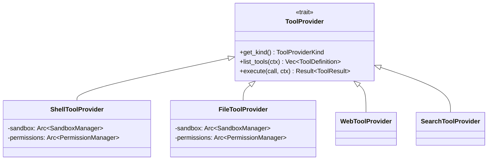

| Tool | Provider | Approval Required |
|---|---|---|
| `shell_exec` | ShellToolProvider | ✅ Yes |
| `read_file` | FileToolProvider | ❌ No |
| `write_file` | FileToolProvider | ✅ Yes |
| `create_directory` | FileToolProvider | ✅ Yes |
| `grep_search` | SearchToolProvider | ❌ No |
| `web_fetch` | WebToolProvider | ❌ No |

All file/command operations pass through `SandboxManager`, which enforces `SandboxMode` (read-only, workspace-write, danger-full-access).

---

### Approval Pipeline

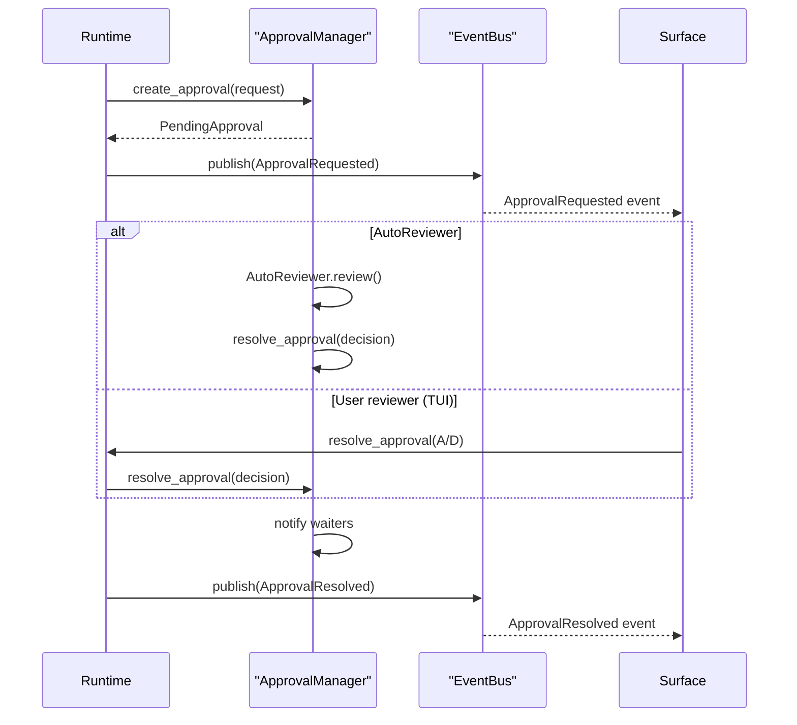

Approvals time out after a configurable number of seconds and are auto-resolved as `TimedOut`.

---

### Event Bus

`EventBus` in `runtime.rs` uses a Tokio `broadcast` channel (capacity 1024). Every surface subscribes with an optional `thread_id` filter.

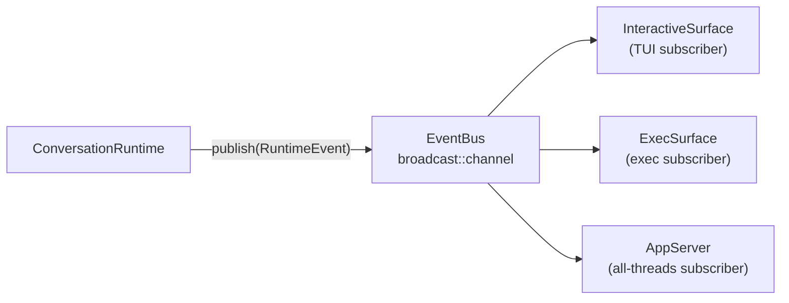

`RuntimeEventKind` values:

- `ThreadStarted` / `TurnStarted` / `TurnCompleted` / `TurnFailed`
- `ItemStarted` / `ItemUpdated` / `ItemCompleted`
- `ApprovalRequested` / `ApprovalResolved`
- `Warning` / `Disconnected`

---

## LLM Layer

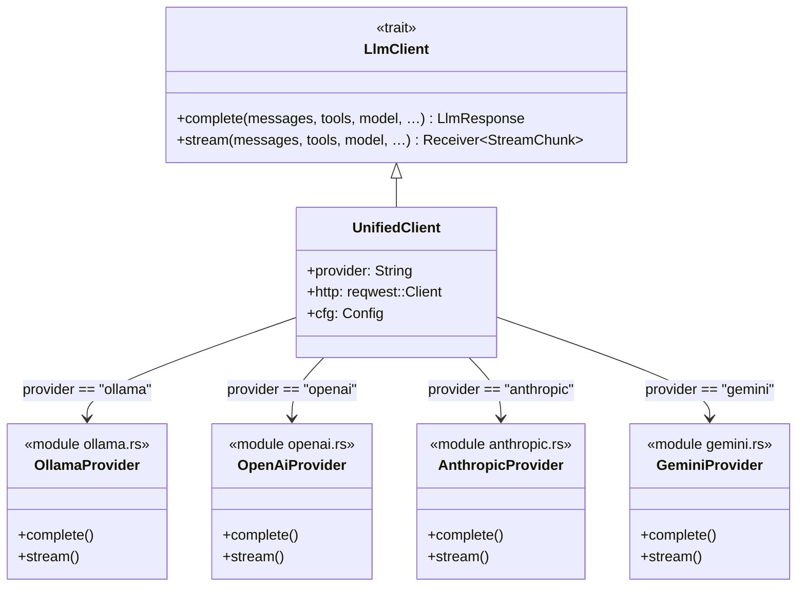

`StreamChunk` variants flowing from provider to runtime:

```
StreamChunk::Text(delta)
StreamChunk::ToolCallDelta { index, id, name, arguments_delta }
StreamChunk::Usage(TokenUsage)
StreamChunk::Done
```

---

## Surface Layer

### InteractiveSurface (TUI)

`InteractiveSurface` in `surfaces.rs` creates / resumes a thread then hands off to `run_interactive_tui()` in `interactive_tui.rs`.

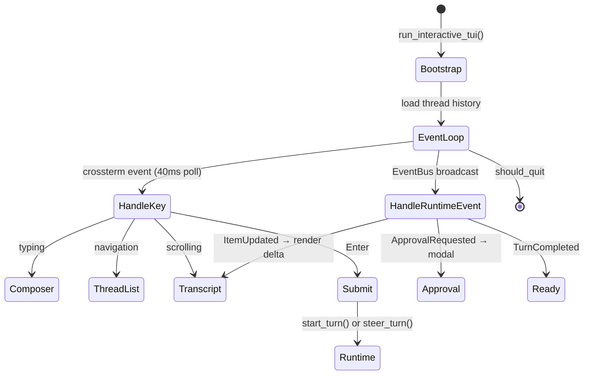

Three panes, cycled with **Tab**:

| Pane | Focus | Keys |
|---|---|---|
| Threads | `FocusPane::Threads` | ↑↓ navigate, Enter open |
| Transcript | `FocusPane::Transcript` | ↑↓ scroll, PgUp/PgDn, End auto-scroll |
| Composer | `FocusPane::Composer` | Enter submit, Shift+Enter newline |

Slash commands: `/new`, `/fork`, `/quit`, `/exit`, `/interrupt`, `/threads`, `/open <id>`, `/resume <id>`, `/help`

---

### ExecSurface

Headless, non-interactive. Starts a turn, listens on EventBus, prints deltas to stdout (Human mode) or as JSONL.

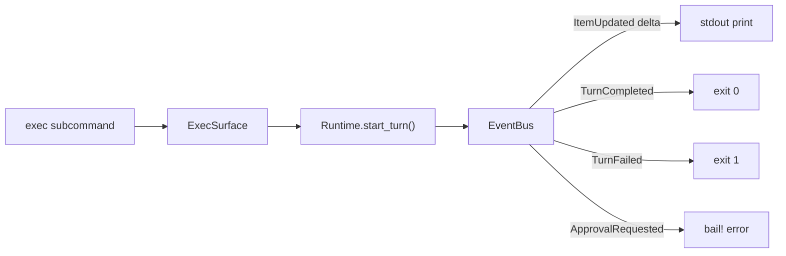

---

### AppServer (JSON-RPC)

Full JSON-RPC 2.0 server over stdio. Used by IDE extensions and GUI clients.

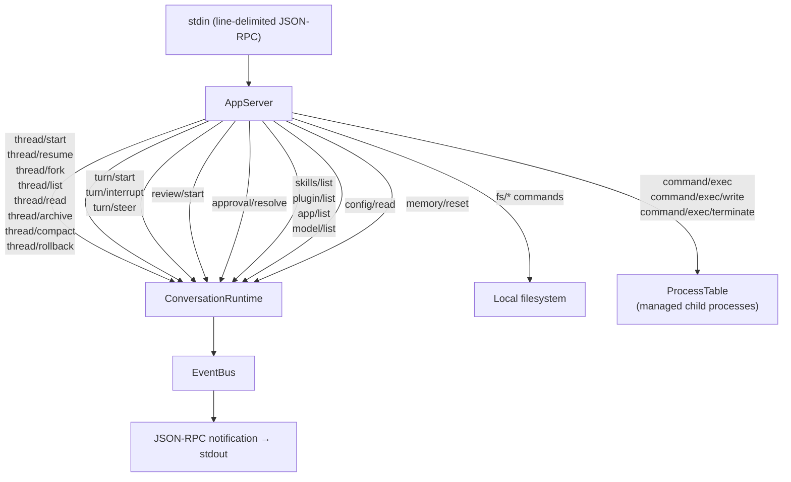

---

### ExecServer (JSON-RPC)

Lightweight process-management-only server. No `ConversationRuntime` dependency.

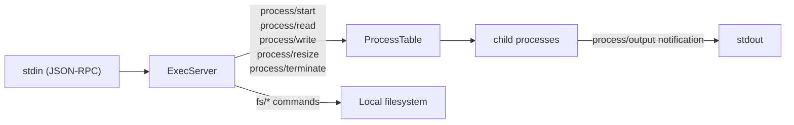

---

## Data Model

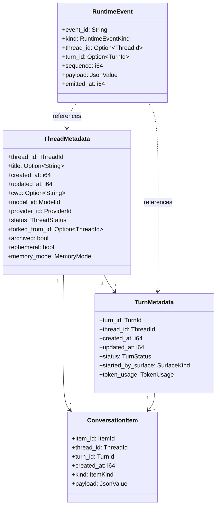

`ItemKind` values: `UserMessage`, `UserAttachment`, `AgentMessage`, `ReasoningText`, `ReasoningSummary`, `ToolCall`, `ToolResult`, `CommandExecution`, `CommandOutput`, `FileChange`, `Error`, `ReviewMarker`, `Status`

---

## Key Flows

### Interactive Turn Flow

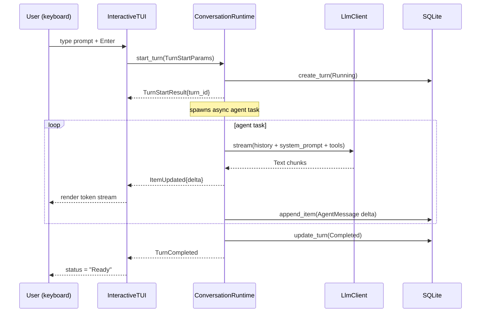

---

### Tool Call Round-trip

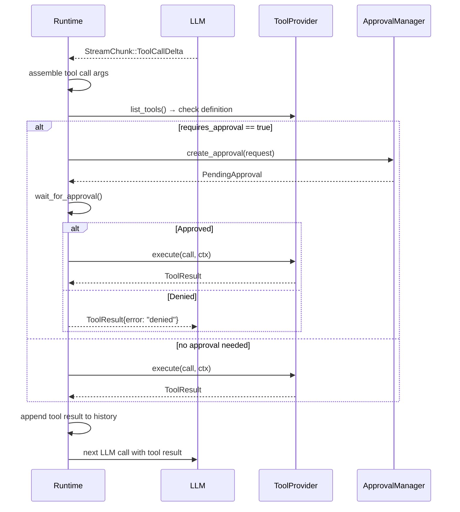

---

### Approval Flow

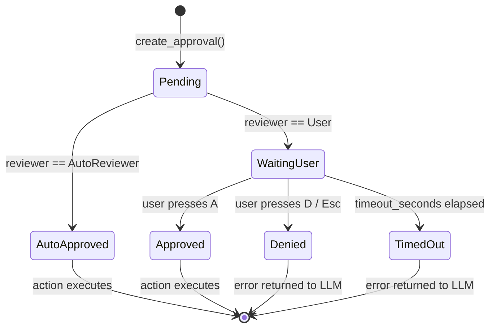

---

*Generated from source at `src/` — Codezilla v2.0.0*
