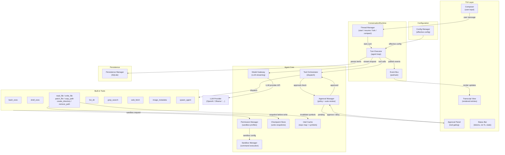
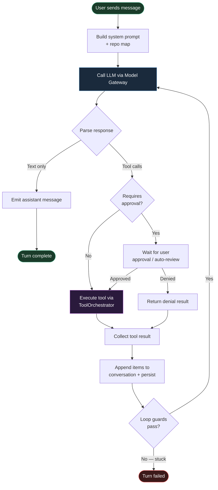
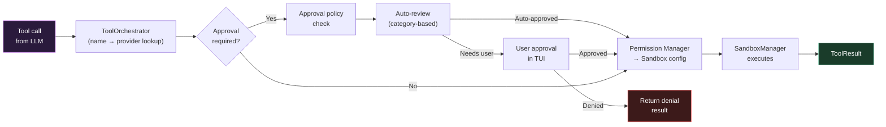
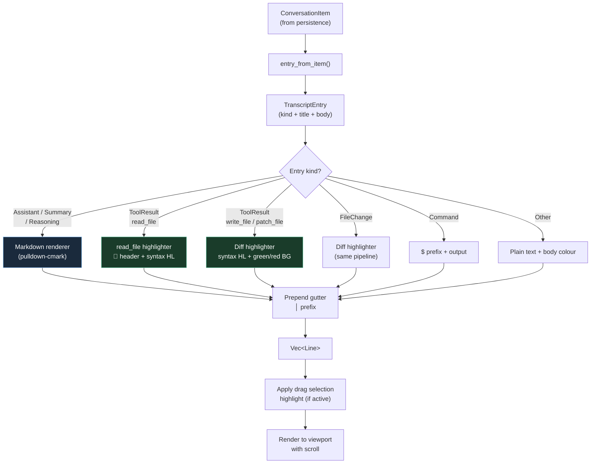
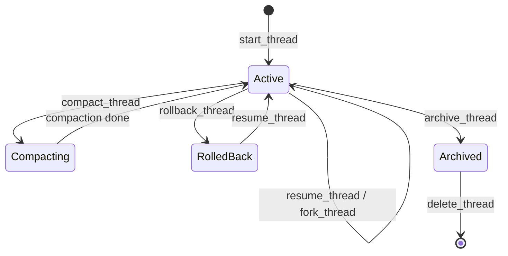
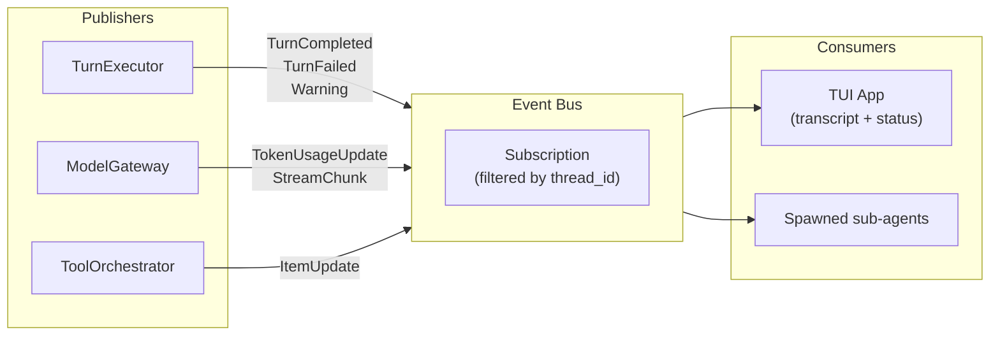
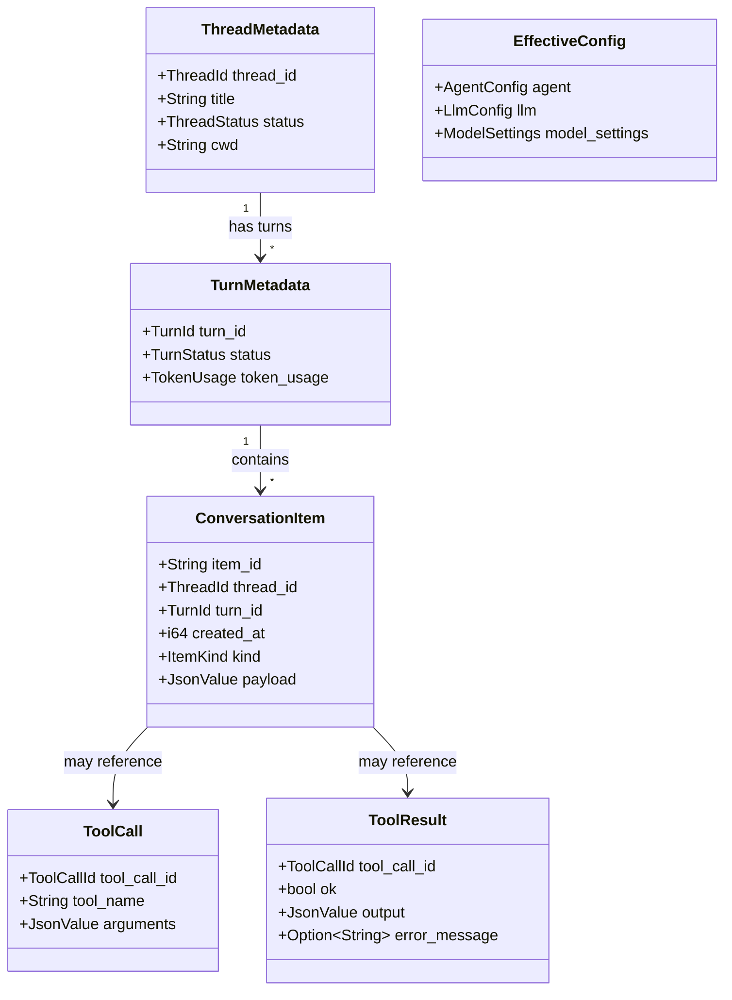
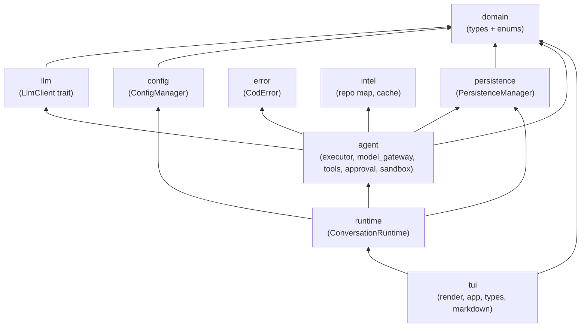

# Codezilla Architecture

## High-Level Overview

Codezilla is a terminal-based AI coding assistant built in Rust. It runs an
**agentic loop** — the LLM reasons, calls tools, observes results, and repeats
until the task is done — all rendered in a rich TUI with syntax highlighting,
diff colours, and approval gates.

## The Agentic Turn Loop

The core of Codezilla is the **TurnExecutor** agent loop. Each user message
starts a turn; the turn keeps running until the model produces a final
assistant message with no tool calls.

### Loop Guards

The executor has several guards to prevent infinite or degenerate loops:

| Guard | Trigger | Action |
|-------|---------|--------|
| Consecutive failures | Every tool in a round returns `ok: false` | Nudge → fail after threshold |
| Absolute backstop | Too many iterations (≈100) | Fail the turn |
| Read-only saturation | 4+ rounds of only read tools | Nudge to act |
| Empty response | Model returns neither text nor tool calls | Retry once, then fail |
| Cumulative nudges | Too many nudges of any kind | Fail fast |
| Repetition detection | Model repeats the same read pattern | Nudge to break out |

## Tool Dispatch Pipeline

When the LLM requests a tool call, it goes through a multi-stage pipeline
before execution:

## TUI Rendering Pipeline

The TUI renders conversation entries as styled `Line`s using ratatui:

### Syntax Highlighting & Diff Colours

- **`read_file` results** — detected by `📄` header → language inferred from
  path → `highlight_code_line()` applies keyword/string/comment colours.
- **`write_file` / `patch_file` diffs** — detected by `---`/`+++`/`@@` markers →
  language inferred from diff header → added lines get `BG_DIFF_ADD`
  (green tint `Rgb(20,60,30)`), removed lines get `BG_DIFF_REMOVE` (red tint
  `Rgb(60,20,20)`), each with syntax highlighting on top.

## Thread Lifecycle

## Event Flow

Runtime events flow from the agent core to the TUI via the event bus:

## Key Data Types

## Module Dependency Map

