# Codezilla Architecture

## High-Level Overview

Codezilla is a terminal-based AI coding assistant built in Rust. It runs an
**agentic loop** — the LLM reasons, calls tools, observes results, and repeats
until the task is done — all rendered in a rich TUI with syntax highlighting,
diff colours, collapsible entries, and approval gates.

It can also operate headlessly via an **exec surface** (`codezilla exec`) or
expose its full API over a **JSON-RPC stdio server** for IDE integrations.

```mermaid
graph TB
    subgraph TUI["TUI Layer"]
        Composer["Composer<br/>(user input)"]
        Transcript["Transcript View<br/>(rendered entries,<br/>collapsible)"]
        ApprovalPanel["Approval Panel<br/>(tool gating)"]
        StatusBar["Status Bar<br/>(tokens, ctx %, state)"]
        ActivityPanel["Activity Panel<br/>(in-flight tools,<br/>sub-agent tree)"]
    end

    subgraph Surfaces["Surface Layer"]
        Interactive["InteractiveSurface<br/>(TUI)"]
        Exec["ExecSurface<br/>(headless / CI)"]
        AppSrv["AppServer<br/>(JSON-RPC stdio)"]
        ExecSrv["ExecServer<br/>(process-only)"]
    end

    subgraph Runtime["ConversationRuntime"]
        ThreadMgr["Thread Manager<br/>(start / resume / fork /<br/>compact / rollback)"]
        TurnMgr["Turn Executor<br/>(agent loop)"]
        EventBus["Event Bus<br/>(pub/sub)"]
        Builder["RuntimeBuilder<br/>(DI wiring)"]
    end

    subgraph Agent["Agent Core"]
        ModelGateway["Model Gateway<br/>(LLM streaming)"]
        ToolOrchestrator["Tool Orchestrator<br/>(dispatch + batching)"]
        ApprovalMgr["Approval Manager<br/>(policy + auto-review)"]
        PermissionMgr["Permission Manager<br/>(sandbox profiles)"]
        SandboxMgr["Sandbox Manager<br/>(command execution)"]
        CheckpointStore["Checkpoint Store<br/>(undo snapshots)"]
        Supervisor["Agent Supervisor<br/>(sub-agent lifecycle)"]
        ExtMgr["Extension Manager<br/>(skills, plugins,<br/>connectors)"]
    end

    subgraph Intel["Codebase Intelligence"]
        RepoMap["RepoMap<br/>(structural summary)"]
        IntelCache["IntelCache<br/>(SHA2-keyed symbols)"]
        SymbolExtractor["Symbol Extractor<br/>(regex, no tree-sitter)"]
        Walker["Walker<br/>(gitignore-aware)"]
    end

    subgraph Tools["Built-in Tools"]
        BashTool["bash_exec"]
        ShellTool["shell_exec"]
        FileTool["read_file / write_file<br/>patch_file / copy_path<br/>create_directory / remove_path"]
        ListDirTool["list_dir"]
        SearchTool["grep_search"]
        WebTool["web_fetch"]
        ImageTool["image_metadata"]
        SpawnAgent["spawn_agent"]
        UserInput["request_user_input"]
    end

    subgraph MCP["MCP (Model Context Protocol)"]
        McpRegistry["McpRegistry<br/>(unified ToolProvider)"]
        McpStdio["StdioMcpClient<br/>(per-server)"]
    end

    subgraph Persistence["Persistence"]
        PersistMgr["Persistence Manager<br/>(SQLite + filesystem)"]
    end

    subgraph Config["Configuration"]
        ConfigMgr["Config Manager<br/>(effective config)"]
    end

    subgraph Bench["Benchmark Infrastructure"]
        BenchRunner["Bench Runner<br/>(parallel task exec)"]
        BenchTask["Task Loader<br/>(YAML specs)"]
    end

    Composer --> Interactive
    Interactive --> ThreadMgr
    Exec --> ThreadMgr
    AppSrv --> ThreadMgr
    ThreadMgr -->|start_turn| TurnMgr
    TurnMgr -->|stream request| ModelGateway
    TurnMgr -->|tool calls| ToolOrchestrator
    ToolOrchestrator -->|dispatch| Tools
    ToolOrchestrator -->|dispatch| McpRegistry
    McpRegistry -->|stdio| McpStdio
    ToolOrchestrator -->|approval check| ApprovalMgr
    ApprovalMgr -->|pending| ApprovalPanel
    ApprovalPanel -->|approve / deny| ApprovalMgr
    ApprovalMgr -->|approved| ToolOrchestrator
    Tools -->|sandbox request| PermissionMgr
    PermissionMgr -->|sandbox config| SandboxMgr
    FileTool -->|snapshot before write| CheckpointStore
    FileTool -->|invalidate symbols| IntelCache
    SpawnAgent -->|delegate| Supervisor
    Supervisor -->|ephemeral thread + turn| ThreadMgr
    TurnMgr -->|persist items| PersistMgr
    TurnMgr -->|publish events| EventBus
    EventBus -->|render updates| Transcript
    EventBus -->|activity tracking| ActivityPanel
    ConfigMgr -->|effective config| TurnMgr
    TurnMgr -->|inject repo map| RepoMap
    RepoMap --> Walker
    RepoMap --> SymbolExtractor
    RepoMap --> IntelCache
    ModelGateway -->|LLM provider API| LLM["LLM Provider<br/>(Anthropic / OpenAI /<br/>Gemini / Ollama)"]
    BenchRunner -->|codezilla exec| Exec
```

## The Agentic Turn Loop

The core of Codezilla is the **TurnExecutor** agent loop. Each user message
starts a turn; the turn keeps running until the model produces a final
assistant message with no tool calls.

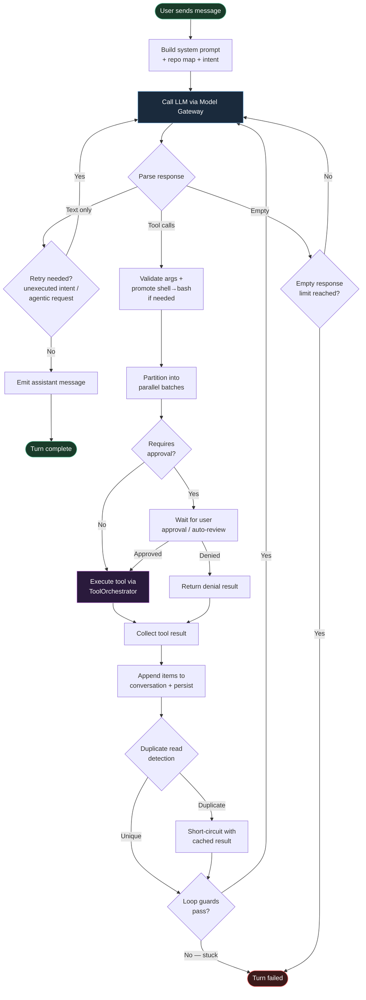

### Loop Guards

The executor has several guards to prevent infinite or degenerate loops:

| Guard | Trigger | Action |
|-------|---------|--------|
| Consecutive failures | Every tool in a round returns `ok: false` | Nudge → fail after threshold |
| Absolute backstop | Too many iterations (≈100) | Fail the turn |
| Read-only saturation | 4+ rounds of only read tools | Nudge to act |
| Empty response | Model returns neither text nor tool calls | Retry once, then fail |
| Cumulative nudges | Too many nudges of any kind | Fail fast |
| Repetition detection | Model repeats the same read pattern | Nudge to break out |
| Cross-round dedup | Same tool call signature across rounds | Short-circuit with prior result |

### Turn Intent Classification

Before the first LLM call, the executor classifies the user's request into
one of `Edit`, `Debug`, `Review`, `Answer`, `Inventory`, or `Unknown`. This
drives decisions like whether a text-only response should trigger a retry
nudge and how verbose the repo map injection should be.

## Tool Dispatch Pipeline

When the LLM requests tool calls, they go through a multi-stage pipeline:

```mermaid
flowchart LR
    ToolCalls["Tool calls<br/>from LLM"] --> Validate["Validate args<br/>+ promote shell→bash"]
    Validate --> Batch["Partition into<br/>parallel batches<br/>(write-set conflict)"]
    Batch --> Orchestrator["ToolOrchestrator<br/>(name → provider)"]
    Orchestrator --> Approval{Approval<br/>required?}
    Approval -->|Yes| Policy["Approval policy<br/>check"]
    Policy --> AutoReview["Auto-review<br/>(category-based)"]
    AutoReview -->|Auto-approved| Sandbox
    AutoReview -->|Needs user| UserApproval["User approval<br/>in TUI"]
    UserApproval -->|Approved| Sandbox
    UserApproval -->|Denied| Denied["Return denial<br/>result"]
    Approval -->|No| Sandbox["Permission Manager<br/>→ Sandbox config"]
    Sandbox --> Execute["SandboxManager<br/>executes"]
    Execute --> Checkpoint{"File write?"}
    Checkpoint -->|Yes| Snap["CheckpointStore<br/>pre-state snapshot"]
    Snap --> Result["ToolResult"]
    Checkpoint -->|No| Result

    style ToolCalls fill:#2a1a3c,stroke:#dc8cff,color:#fff
    style Result fill:#1a3c2a,stroke:#64c8a3,color:#fff
    style Denied fill:#3c1a1a,stroke:#ff6464,color:#fff
```

### Parallel Batching

Tool calls are partitioned into sequential batches using write-set analysis.
Consecutive calls whose write sets don't conflict are grouped into a single
batch and executed with `join_all`. Any call with an unknown or conflicting
write set forces a serialisation barrier. Read-only tools (`read_file`,
`list_dir`, `grep_search`) are always parallel-safe.

## Sub-Agent Supervision

The `AgentSupervisor` manages the lifecycle of child agents spawned via the
`spawn_agent` tool:

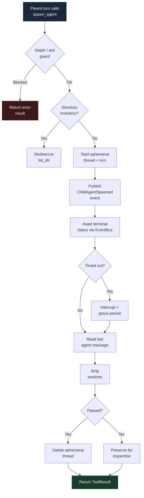

Key constraints:
- **Concurrency**: Controlled by a `Semaphore` (`max_concurrent_child_agents`)
- **Depth**: `max_spawn_depth` prevents unbounded recursive spawning
- **Directory inventory redirect**: Prompts that look like "list all files recursively"
  are short-circuited to `list_dir` instead of spawning a model sub-agent

## Codebase Intelligence

The `intel` module provides a structural repository summary injected into the
system prompt at turn start, reducing blind `read_file` / `list_dir` calls:

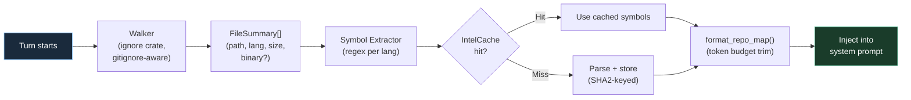

Design decisions:
- **No tree-sitter** — symbols extracted via compiled `Regex` patterns (good enough for navigation)
- **No external processes** — the `ignore` crate handles `.gitignore` traversal in pure Rust
- **O(1) per-call after first run** — SHA2-keyed in-process cache; file writes invalidate entries

## TUI Rendering Pipeline

The TUI renders conversation entries as styled `Line`s using ratatui:

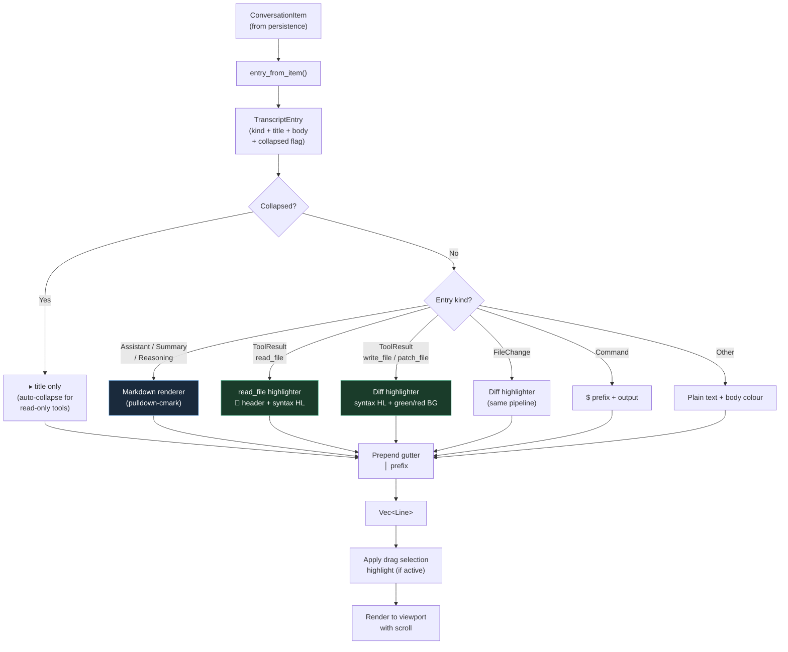

### Syntax Highlighting & Diff Colours

- **`read_file` results** — detected by `📄` header → language inferred from
  path → `highlight_code_line()` applies keyword/string/comment colours.
- **`write_file` / `patch_file` diffs** — detected by `---`/`+++`/`@@` markers →
  language inferred from diff header → added lines get `BG_DIFF_ADD`
  (green tint `Rgb(20,60,30)`), removed lines get `BG_DIFF_REMOVE` (red tint
  `Rgb(60,20,20)`), each with syntax highlighting on top.

### Collapsible Entries

Read-only tool results (`read_file`, `list_dir`, `grep_search`) are
auto-collapsed by default. Each `TranscriptEntry` carries a `collapsed: bool`
flag; when collapsed, only a `▸ title` chevron line is rendered instead of
the full body, reducing transcript noise.

## Activity Tracking

The `ActivityState` reducer tracks in-flight agent work for the TUI header
and activity panel:

- **Tool tracking**: every in-flight tool call with name, hint, and `started_at`
- **Sub-agent tracking**: `ChildAgentActivity` entries with lifecycle status
  (Running → Completed / Failed / Interrupted / TimedOut)
- **Blocked state**: approval waits override the header display
- **Panel rendering**: multi-tool batches and sub-agents get a dedicated panel
  (capped at 6 rows)

## Thread Lifecycle

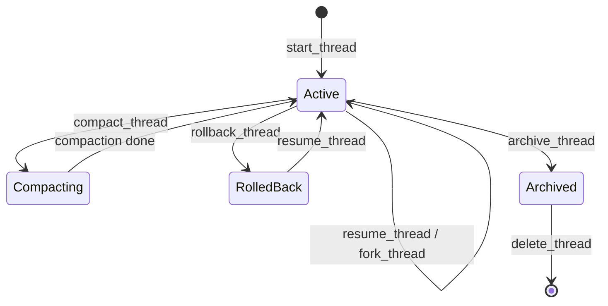

## Event Flow

Runtime events flow from the agent core to consumers via the event bus:

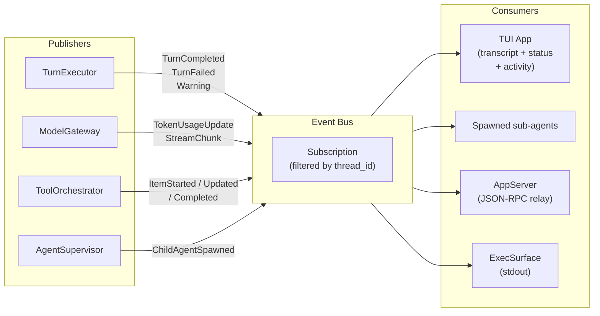

### Typed Event Payloads

The `event_payload` module provides a typed consumer-side view over the
JSON event payloads. `RuntimeEventPayload` is a tagged enum with variants
for every `RuntimeEventKind`, enabling pattern-matching instead of manual
JSON parsing:

| Variant | Key fields |
|---------|-----------|
| `TurnCompleted` | `turn_id`, `token_usage`, `metrics`, `file_changes` |
| `TurnFailed` | `kind` (error label), `reason` |
| `ItemUpdated` | `item_id`, `delta` (streaming), `mode` |
| `ChildAgentSpawned` | `parent_tool_call_id`, `child_thread_id`, `label` |
| `CompactionStatus` | `status` ("started" / "completed" / "failed") |
| `TokenUsageUpdate` | `input_tokens`, `output_tokens`, `cached_tokens` |

## LLM Provider Layer

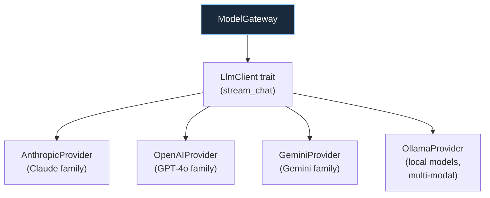

The `ModelGateway` handles token estimation, context-window budgeting,
and streaming response assembly. Token estimation uses character-based
heuristics with per-field multipliers for JSON serialisation overhead.

## Key Data Types

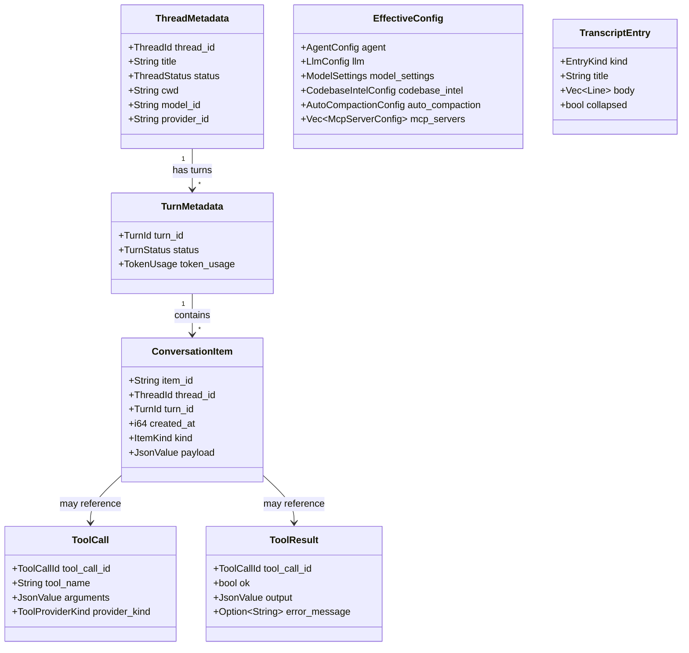

## Benchmark Infrastructure

The `bench` module provides a task-based evaluation harness:

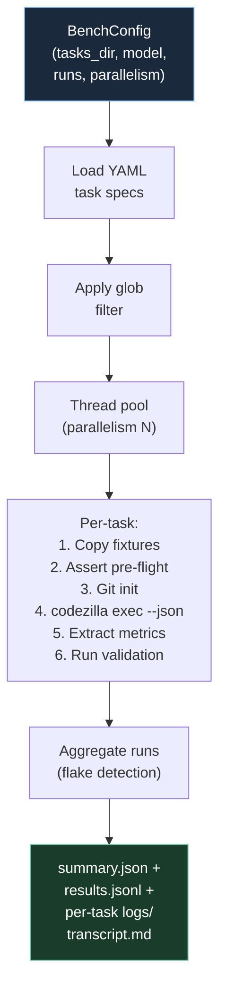

Features: cost estimation (per-model pricing tables), timeout enforcement,
multi-run flake detection, workspace preservation on failure, human-readable
transcript generation from event streams.

## Module Dependency Map

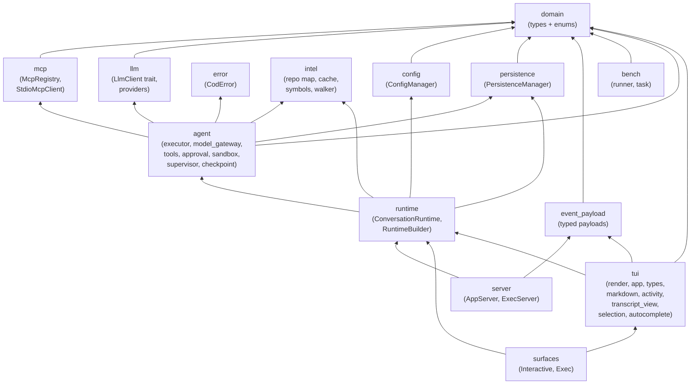

## Directory Layout

```
src/
├── main.rs                    # CLI entry point (clap)
├── llm/
│   ├── mod.rs                 # LlmClient trait
│   ├── client.rs              # HTTP client wrapper
│   └── providers/
│       ├── anthropic.rs       # Claude family
│       ├── openai.rs          # GPT-4o family
│       ├── gemini.rs          # Gemini family
│       └── ollama.rs          # Local models (multi-modal)
├── logger/                    # Structured logging setup
└── system/
    ├── mod.rs                 # Public re-exports
    ├── domain.rs              # Core types, enums, constants
    ├── error.rs               # CodError hierarchy
    ├── config.rs              # ConfigManager, EffectiveConfig
    ├── persistence.rs         # SQLite + filesystem persistence
    ├── event_payload.rs       # Typed event payload enum
    ├── surfaces.rs            # InteractiveSurface, ExecSurface
    ├── server.rs              # AppServer, ExecServer (JSON-RPC)
    ├── agent/
    │   ├── mod.rs             # Agent subsystem re-exports
    │   ├── executor.rs        # TurnExecutor (main loop)
    │   ├── executor/
    │   │   ├── context.rs     # TurnContext builder
    │   │   ├── tool_dispatch.rs # Batch dispatch + dedup
    │   │   └── utils.rs       # Guards, intent, validation
    │   ├── model_gateway.rs   # LLM streaming + token budget
    │   ├── tools.rs           # Built-in tool providers
    │   ├── supervisor.rs      # Sub-agent spawn/await/cancel
    │   ├── approval.rs        # Approval policies
    │   ├── permission.rs      # Permission profiles
    │   ├── sandbox.rs         # Command sandboxing
    │   ├── checkpoint.rs      # Pre-write state snapshots
    │   ├── event_bus.rs       # Pub/sub event distribution
    │   └── extensions.rs      # Skills, plugins, connectors
    ├── intel/
    │   ├── mod.rs             # RepoMap entry point
    │   ├── walker.rs          # Gitignore-aware file walker
    │   ├── symbols.rs         # Regex-based symbol extraction
    │   ├── cache.rs           # SHA2-keyed symbol cache
    │   └── format.rs          # Token-budgeted map formatter
    ├── mcp/
    │   ├── mod.rs             # MCP module entry
    │   ├── registry.rs        # Multi-server tool routing
    │   └── stdio.rs           # Stdio MCP client transport
    ├── runtime/
    │   ├── mod.rs             # ConversationRuntime, params
    │   ├── builder.rs         # RuntimeBuilder (DI)
    │   ├── thread.rs          # Thread lifecycle ops
    │   ├── turn.rs            # Turn lifecycle ops
    │   └── discovery.rs       # Model discovery
    ├── bench/
    │   ├── mod.rs             # Bench module entry
    │   ├── runner.rs          # Parallel task runner
    │   └── task.rs            # YAML task spec loader
    └── tui/
        ├── mod.rs             # TUI entry point
        ├── app.rs             # InteractiveApp state machine
        ├── render.rs          # Layout + widget rendering
        ├── types.rs           # TranscriptEntry, EntryKind
        ├── transcript_view.rs # Scrollable transcript widget
        ├── markdown.rs        # Markdown → ratatui Lines
        ├── activity.rs        # ActivityState reducer
        ├── approval.rs        # Approval dialog widget
        ├── input.rs           # Input handling
        ├── selection.rs       # Drag-select + copy
        ├── autocomplete.rs    # Slash-command completion
        ├── composer_history.rs# Input history (↑/↓)
        └── threads.rs         # Thread picker overlay
```